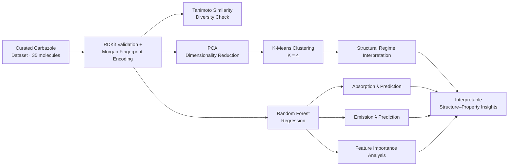

# Elucidating Structure–Emission Relationships in Carbazole Fluorophores Using Machine Learning

[](LICENSE)
[](https://doi.org/10.1016/j.chemphys.2026.113334)
[](https://www.python.org/)

> Official code repository for the study predicting the absorption and emission wavelengths of carbazole-based fluorophores designed for bioimaging applications, using an interpretable machine learning workflow.

Published in *Chemical Physics* **610** (2026) 113334, and presented as an oral presentation at the **Turkish Physical Society 42nd International Physics Congress** (Bodrum, Türkiye, 31 August – 4 September 2026).

---

## 📖 Overview

Carbazole is a rigid, tricyclic scaffold with a central nitrogen atom that enables strong light absorption and emission — making it one of the most widely used fluorophore cores in OLED emitters, fluorescent probes, and TADF systems. Depending on the substituents attached to it, its emission can shift anywhere from **360 nm to 620 nm** (blue to red).

Rationally predicting *where* a given carbazole derivative will emit — before it is even synthesized — is difficult, because emission tuning depends on multidimensional interactions between conjugation topology, heteroatom placement, and substituent electronics.

This project builds an **interpretable, scaffold-focused machine learning framework** to address that problem:

- Encode molecules with **Morgan (circular) fingerprints** (radius = 2, 2048 bits), validated with **RDKit**
- Check dataset diversity via **pairwise Tanimoto similarity**
- Visualize the structural embedding space with **Principal Component Analysis (PCA)**
- Recover latent emission regimes with **K-Means clustering** — using only structural fingerprints, with no emission labels
- Predict absorption and emission wavelengths with **Random Forest regression**
- Interpret which structural features drive emission tuning via feature-importance analysis

The novelty is **not a new algorithm** — it is combining Morgan fingerprints, PCA, K-Means, and Random Forest into a single, interpretable, carbazole-specific pipeline.

---

## 🔬 Workflow



---

## 🧪 Dataset

| | |
|---|---|
| Initial literature pool | 120 carbazole-based structures |
| Retained after curation | **35** carbazole derivatives |
| Application focus | Organelle-imaging fluorophores |
| Absorption range | 300–400 nm |
| Emission range | 360–620 nm |

**Exclusion criteria applied during curation:**
- Molecules with incomplete absorption or emission data
- Structures with ambiguous or unclear assignment
- Duplicate entries already reported in the literature
- Any molecule with a chemically invalid SMILES representation

No smoothing, normalization, or synthetic augmentation was applied — every value is an original experimental measurement.

**Diversity check:** pairwise Tanimoto similarity ranged between **0.45–0.75**, with no pair near unity — confirming zero duplicate structures in the curated set.

---

## 📊 Key Results

**Chemical embedding (PCA):**
- PC1 explains 17.58% of variance, PC2 explains 12.26%
- Molecules cluster tightly on PC1 (shared carbazole core); spread on PC2 reflects substituent-level differences
- One clear structural outlier identified
- No single directional trend → emission tuning is multidimensional

**K-Means clustering (K = 4, chosen via inertia, silhouette score, and Davies–Bouldin index):**
Structural fingerprints alone — with no emission labels — recovered four separated emission regimes (approx. 430–440 nm, ~450 nm, 480–490 nm, 510–580 nm).

**Absorption–emission consistency:**
- Clear positive correlation between absorption and emission wavelength
- Emission exceeds absorption for every molecule → universally positive Stokes shift
- Most common Stokes shift range: 80–160 nm

**Random Forest regression (80:20 train–test split, 5-fold cross-validation):**

| Target | R² (test) | MAE |
|---|---|---|
| Emission wavelength | 0.88 | 12.4 nm |
| Absorption wavelength | 0.90 | 8.7 nm |

**Most influential structural features:** aromatic connectivity, heteroatom-containing fragments, extended conjugated motifs — consistent with the well-established sensitivity of carbazole emission to π-conjugation and donor–acceptor interactions.

---

## ⚠️ Limitations & Future Work

**Limitations**
- Small dataset — only 35 curated molecules
- No genuinely independent external test set
- Mechanistic interpretations remain hypothesis-level

**Future work**
- Expand the dataset with new, independently reported derivatives
- Add electronic descriptors such as the HOMO–LUMO gap
- Explore an NLP module for literature-based use-case detection

---

## 📁 Repository Structure

```
.
├── data/                  # Curated carbazole dataset (SMILES + absorption/emission values)
├── notebooks/             # Analysis and modeling notebooks (.ipynb)
├── src/                   # Reusable Python modules (.py)
├── results/               # Generated plots (PCA map, clustering, Stokes shift, feature importance)
├── requirements.txt       # Python dependencies
├── LICENSE                # MIT License
└── README.md
```

> Note: `data/`, `notebooks/`, `src/`, and `results/` will be populated as files are added to the repository.

---

## ⚙️ Installation

```bash
# Clone the repository
git clone https://github.com/emindemlikoglu/Elucidating-Structure-Emission-Relationships-in-Carbazole-Fluorophores-Using-Machine-Learning.git
cd Elucidating-Structure-Emission-Relationships-in-Carbazole-Fluorophores-Using-Machine-Learning

# Create a virtual environment (recommended)
python -m venv venv
source venv/bin/activate      # Windows: venv\Scripts\activate

# Install dependencies
pip install -r requirements.txt
```

### `requirements.txt`

```
rdkit
scikit-learn
pandas
numpy
matplotlib
seaborn
jupyter
```

> Pin exact versions (`==x.y.z`) once the code is finalized, for reproducibility.

---

## 🚀 Usage

```bash
# Run the analysis via Jupyter
jupyter notebook notebooks/

# or as a script (example — update once real filenames are added)
python src/train_model.py --data data/carbazole_dataset.csv
```

---

## 🎤 Presentations

This work was presented as an **oral presentation** at:

> **Turkish Physical Society 42nd International Physics Congress**
> Bodrum, Türkiye — 31 August – 4 September 2026

---

## 📄 Citation

If you use this work, please cite:

```bibtex
@article{demlikoglu2026carbazole,
  title   = {Interpretable machine learning for predicting the fluorescence properties of carbazole derivatives for bioimaging},
  author  = {Demlikoglu, Muhammed Emin and Aydemir, Murat},
  journal = {Chemical Physics},
  volume  = {610},
  pages   = {113334},
  year    = {2026},
  doi     = {10.1016/j.chemphys.2026.113334},
  url     = {https://doi.org/10.1016/j.chemphys.2026.113334}
}
```

📎 Paper: [View on ScienceDirect](https://www.sciencedirect.com/science/article/abs/pii/S0301010426002570)

---

## 👥 Authors

- **M. Emin Demlikoğlu** — Dept. of Computer Engineering, Faculty of Engineering and Architecture, Erzurum Technical University
  Data curation, ML workflow, formal analysis, validation, visualization
- **Assoc. Prof. Dr. Murat Aydemir** — Dept. of Photonics, Faculty of Science, Erzurum Technical University
  Study design, supervision, methodology, photophysical interpretation

---

## 📜 License

This project is licensed under the [MIT License](LICENSE) — you're free to use, modify, and distribute it, with attribution.

---

## 🤝 Contributing

Bug reports, suggestions, and pull requests are welcome. For major changes, please open an issue first to discuss what you'd like to change.
