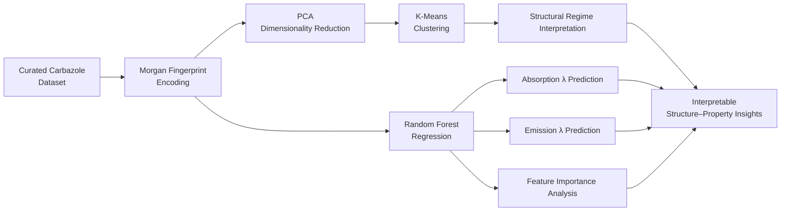

# Interpretable Machine Learning for Predicting the Fluorescence Properties of Carbazole Derivatives for Bioimaging

[](LICENSE)
[](https://doi.org/10.1016/j.chemphys.2026.113334)
[](https://www.python.org/)

> Official code repository for the study predicting the absorption and emission wavelengths of carbazole-based fluorophores designed for bioimaging applications, using an interpretable machine learning workflow.

---

## 📖 Overview

Carbazole-scaffold molecules are important fluorophores widely used in OLEDs, fluorescent probes, and bioimaging. However, predicting a molecule's emission wavelength **before synthesis** remains challenging due to the complexity of structure–property relationships.

This work uses a curated dataset of carbazole derivatives from the literature to:

- Encode molecular structures with **Morgan (circular) fingerprints**,
- Visualize the structural embedding space with **Principal Component Analysis (PCA)**,
- Reveal hidden emission-related regimes via **K-Means clustering**,
- Predict absorption and emission wavelengths with **Random Forest regression**,
- Interpret which structural features (aromatic connectivity, heteroatom incorporation, substituent topology) drive emission tuning, using feature-importance analysis.

The goal is not to introduce a new ML architecture, but to provide a **transparent, data-efficient, scaffold-focused predictive framework** for a chemically coherent family of molecules.

**Key results:** internally validated R² = 0.88 for emission and R² = 0.90 for absorption wavelength prediction, with Stokes shift analysis supporting photophysical consistency.

---

## 🔬 Workflow



---

## 📁 Repository Structure

```
.
├── data/                  # Raw and processed datasets (csv/xlsx)
├── notebooks/             # Analysis and modeling notebooks (.ipynb)
├── src/                   # Reusable Python modules (.py)
├── results/               # Generated plots, model outputs, tables
├── requirements.txt       # Python dependencies
├── LICENSE                # MIT License
└── README.md
```

> Note: `data/`, `notebooks/`, `src/`, and `results/` will be added as code and data are uploaded. Update this section once the structure is finalized.

---

## ⚙️ Installation

```bash
# Clone the repository
git clone https://github.com/emindemlikoglu/Elucidating-Structure-Emission-Relationships-in-Carbazole-Fluorophores-Using-Machine-Learning.git
cd Elucidating-Structure-Emission-Relationships-in-Carbazole-Fluorophores-Using-Machine-Learning

# Create a virtual environment (recommended)
python -m venv venv
source venv/bin/activate      # Windows: venv\Scripts\activate

# Install dependencies
pip install -r requirements.txt
```

### Suggested `requirements.txt` contents

Based on the methods used (fingerprinting + PCA + K-Means + Random Forest):

```
rdkit
scikit-learn
pandas
numpy
matplotlib
seaborn
jupyter
```

> Pinning exact versions (`==x.y.z`) is recommended once the code is finalized, for reproducibility.

---

## 🚀 Usage

```bash
# Run the analysis via Jupyter
jupyter notebook notebooks/

# or as a script (example)
python src/train_model.py --data data/carbazole_dataset.csv
```

*(This section will be updated with real filenames and parameters once the code is added.)*

---

## 📊 Results

| Target Variable | R² (test) |
|---|---|
| Emission wavelength | 0.88 |
| Absorption wavelength | 0.90 |

See the paper and the (upcoming) `results/` folder for detailed PCA visualizations and feature-importance plots.

---

## 📄 Citation

If you use this work, please cite:

```bibtex
@article{demlikoglu2026carbazole,
  title   = {Interpretable machine learning for predicting the fluorescence properties of carbazole derivatives for bioimaging},
  author  = {Demlikoglu, Muhammed Emin and Aydemir, Murat},
  journal = {Chemical Physics},
  year    = {2026},
  doi     = {10.1016/j.chemphys.2026.113334},
  url     = {https://doi.org/10.1016/j.chemphys.2026.113334}
}
```

📎 Paper: [View on ScienceDirect](https://www.sciencedirect.com/science/article/abs/pii/S0301010426002570)

---

## 👥 Authors

- **Muhammed Emin Demlikoglu** — Data curation, ML workflow, formal analysis, validation, visualization
- **Murat Aydemir** — Study design, supervision, methodology, photophysical interpretation

---

## 📜 License

This project is licensed under the [MIT License](LICENSE) — you're free to use, modify, and distribute it, with attribution.

---

## 🤝 Contributing

Bug reports, suggestions, and pull requests are welcome. For major changes, please open an issue first to discuss what you'd like to change.
